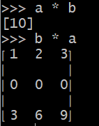
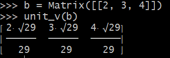
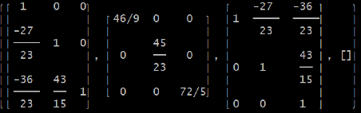
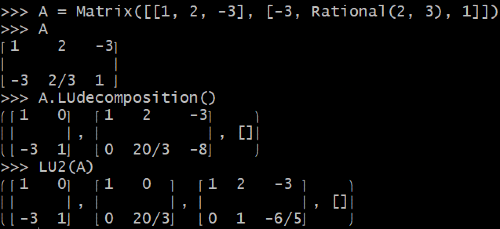

title: Vectors - Chapter 1 (1.1, 1.2)
date: 2021-10-30
category: la  # la stands for Linear Algebra
keywords: Matrix, Sympy
   


--> [Notes](#notes) 

--> [Lab](#lab) * 2 

-------------

##### Notes {:#notes}

* For $ v \cdot w $, multiply each $\(v_i\)$ times $\(w_i\)$. Then $\(v \cdot w = v_1w_1 + \dots + v_nw_n\)$.   

* The length $\( \lVert v  \rVert \)$ of a vector $\( v\)$ is the square root of $\( v \cdot v \)$:

 $$ \lVert v \rVert = \sqrt{v \cdot v} = (v_1^2 + v_2^2 + \cdots + v_n^2)^{\frac{1}{2}}   $$

* A unit vector $\(u \)$ is a vector whose length equals one. Then $\(u \cdot u = 1 \)$.

* $\( u = v / \lVert v \rVert \)$ is a unit vector in the same direction as $\( v \)$.
* The standard unit vectors along the $\(x \)$ and $\( y \)$ axes are written $\( i = \left( \begin{smallmatrix}  1 \\ 0      \end{smallmatrix}  \right)   \)$ and $\( j = \left( \begin{smallmatrix}  0 \\ 1      \end{smallmatrix}  \right)   \)$   . In the xy plane, the unit vector that makes an angle "theta" with the x axis is $\( \left( \begin{smallmatrix} cos\theta \\ sin\theta \end{smallmatrix} \right) \)$.

* COSINE FORMULA: If $\( v  \)$ and $\( w  \)$ are nonzero vectors then $\( \frac{v \cdot w}{ \lVert v \rVert \lVert w \rVert }  = cos \theta  \)$
* SCHWARZ INEQUALITY and TRIANGLE INEQUALITY


--------------------
### Labs {:#lab}

General setup 

``` python
>>> from sympy.interactive.printing import init_printing  
>>> init_printing(use_unicode=True)
>>> from sympy.matrices import Matrix
```

1) &#128037 vector multiplication

``` python
>>> a = Matrix([[1, 2, 3]])  # row vector
>>> b = Matrix([1, 0, 3])   # column vector
```



2) &#128037 unit vector 


``` python
>>> from sympy import symbols, sqrt, Rational
>>> v = symbols('v')
>>> def unit_v(v):
>>>     assert v.shape[1] == 1 or v.shape[0] == 1, f"Please input a vector"
>>>     norm = 0
>>>     for x in v:
>>>         norm = norm + x**2;
>>>     norm = sqrt(norm)
>>>     return v / norm 

```



```python
>>> L, U, _ = A.LUdecomposition()
>>> L * U == A
True
```

The leftmost matrix is L, the middle matrix is U, and the rightmost one is P. That P is blank just means that there's no row exchanges during the LU decomposition.

The motivation of this modification is that we want to see the symmetric matrix $\(S= L*D*U = L*D*L^T\)$ more clearly.

``` python
def LU2(A):
    L, U, P = A.LUdecomposition()
    r = U.rank()
    m, n = shape(U)
    D = eye(r)
    for i in range(r):
        pivot = U[i, i]
        D[i, i] = pivot
        for j in range(i, n):
            U[i, j] = U[i, j] / sympify(pivot)    # sympify makes the quotient of the two integers an exact rational number
    return L, D, U, P
```
Here's the result of LUdecomposition:
``` python
>>> B = Matrix([[1, 0, 3], [-2, 3, 5], [Rational(1, 3), 0, -3]])
>>> S = B.T*B    # this step makes a symmetric matrix S; another trick is B*B.T
>>> S.LUdecomposition() 
```


Here's the result of LU2's output:
``` python
>>> LU2(S)
```


In this particular case (check symmetric matrices' $\(L*D*L^T \)$ decomposition), we could see clearly that D (the rightmost matrix) is the transpose of L (the leftmost matrix).


2) &#128037 LUdecompose rectangular shaped matrices A 

Sympy's LUdecomposition is a really sharp tool that it deals with both square and rectangular matrices. While we may not find decomposing rectangular matrics productive, let's just play for fun. 

For this practice, I picked one 2 by 3 matrix A and one 3 by 2 matrix B. I am going to use both Sympy's LUdecomposition and our lightly modified LU2 method to see the matrix decomposition again.




One takeaway I got from this experiment is that A and D seem to share the same shape and rank, while L is always square and full rank.

This is the end of this article, and thanks for reading.


