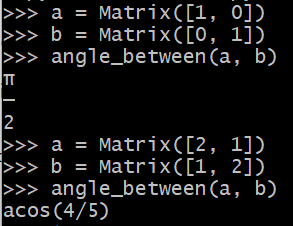
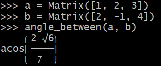

title: Vectors - Chapter 1 (1.1, 1.2)
date: 2022-06-24
category: la  # la stands for Linear Algebra
keywords: Matrix, Sympy
   


--> [Notes](#notes) 

--> [Lab](#lab) * 3 

-------------

##### Notes {:#notes}

* For $ v \cdot w $, multiply each $\(v_i\)$ times $\(w_i\)$. Then $\(v \cdot w = v_1w_1 + \dots + v_nw_n\)$.   

* The length $\( \lVert v  \rVert \)$ of a vector $\( v\)$ is the square root of $\( v \cdot v \)$:

 $$ \lVert v \rVert = \sqrt{v \cdot v} = (v_1^2 + v_2^2 + \cdots + v_n^2)^{\frac{1}{2}}   $$
 

* A unit vector $\(u \)$ is a vector whose length equals one. Then $\(u \cdot u = 1 \)$.

* $\( u = v / \lVert v \rVert \)$ is a unit vector in the same direction as $\( v \)$.
* The standard unit vectors along the $\(x \)$ and $\( y \)$ axes are written $\( i = \left( \begin{smallmatrix}  1 \\ 0      \end{smallmatrix}  \right)   \)$ and $\( j = \left( \begin{smallmatrix}  0 \\ 1      \end{smallmatrix}  \right)   \)$   . In the xy plane, the unit vector that makes an angle "theta" with the x axis is $\( \left( \begin{smallmatrix} cos\theta \\ sin\theta \end{smallmatrix} \right) \)$.

* COSINE FORMULA: If $\( v  \)$ and $\( w  \)$ are nonzero vectors then $\( \frac{v \cdot w}{ \lVert v \rVert \lVert w \rVert }  = cos \theta  \)$
* SCHWARZ INEQUALITY and TRIANGLE INEQUALITY


--------------------
### Labs {:#lab}

Preliminary Setup:

``` python
>>> from sympy.interactive.printing import init_printing  
>>> init_printing(use_unicode=True)
>>> from sympy.matrices import Matrix
```

1) &#128037 vector multiplication

``` python
>>> a = Matrix([[1, 2, 3]])  # row vector
>>> b = Matrix([1, 0, 3])   # column vector
```


2) &#128037 unit vector 


``` python
>>> from sympy import symbols, sqrt, Rational
>>> v = symbols('v')
>>> def unit_v(v):
>>>     assert v.shape[1] == 1 or v.shape[0] == 1, f"Please input a vector"
>>>     norm = 0
>>>     for x in v:
>>>         norm = norm + x**2;
>>>     norm = sqrt(norm)
>>>     return v / norm 

```


3) &#128037 compute angles between two vectors
``` python
def norm_v(v):
    """
    compute the norm of a given vector v
    """
    norm = 0
    for x in v:
        norm += x**2
    norm = sqrt(norm)
    return norm


def unit_v(v):
    """
    calculate the unit vector of a given vector v
    """
    assert v.shape[1] == 1 or v.shape[0] == 1, f"Please input a vector"
    norm = norm_v(v)
    return v / norm 


def dot(v1, v2):
    """
    dot product of vectors v1 and v2, both v1 and v2 ought to be column vectors
    """
    assert v1.shape == v2.shape and v1.shape[1] == 1, f"the input should be column vectors with the same dimension"
    dim = v1.shape[0]
    result = 0
    for i in range(0, dim):
        result += v1[i] * v2[i]
    return result


def angle_between(v1, v2):
    """
    compute the angle between two given vectors according to COSINE FORMULA
    """
    assert v1.shape == v2.shape and v1.shape[1] == 1, f"the input should be column vectors with the same dimension"
    norm_v1 = norm_v(v1)
    norm_v2 = norm_v(v2)
    dot_pdt = dot(v1, v2)
    cos_theta = dot_pdt / (norm_v1 * norm_v2)
    return acos(cos_theta)

```



This is the end of this article, and thanks for reading.


